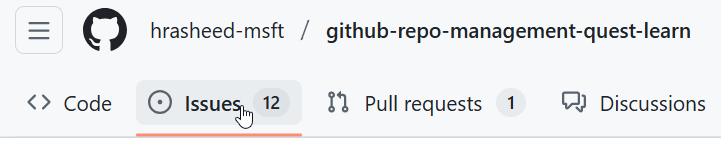

# GitHub Copilot for Repository Management Quest

## Quest Overview

Welcome to the **GitHub Copilot for Repository Management Quest** - an interactive learning experience designed for content developers who want to master GitHub Copilot's native features for repository management workflows. This quest simulates real-world scenarios using **real Microsoft Learn documentation**, covering common challenges like taking over unfamiliar repositories, triaging issue backlogs, and managing complex pull requests.

**What makes this quest unique:** You'll work with actual Microsoft Learn modules while mastering GitHub Copilot's workspace agent, issue analysis, PR summarization, and automated code generation features.

## Learning Objectives

By completing this quest, you will:

1. **Master GitHub Copilot workspace exploration** - Use Copilot's @workspace agent to quickly understand unfamiliar repositories and Microsoft Learn documentation structures
2. **Implement efficient issue management** - Use Copilot to analyze issues, categorize, prioritize, and suggest fixes
3. **Develop advanced PR review skills** - Leverage GitHub Copilot's PR summaries, review suggestions, and inline chat for efficient pull request reviews
4. **Create documentation standards** - Establish quality standards with Copilot-assisted reviews and automated checks
5. **Build practical workflows** - Develop repeatable processes using GitHub Copilot's native capabilities

## Quest Structure

This quest uses **real Microsoft Learn modules** in the `learn-pr/wwl/` folder and contains a foundational module plus four progressive scenarios:

- **Module 0: Workspace Preparation** - Customize your GitHub Copilot workspace with agents and reusable prompts using examples from Microsoft Learn documentation.
- **Scenario 1: The Inheritance** - Take over an unfamiliar Microsoft Fabric documentation repository. Use Copilot to explore the module structure, identify issues, and create an improvement plan.
- **Scenario 2: The Backlog Battle** - Triage 12 open issues in a Microsoft Learn repository. Categorize, prioritize, identify duplicates, and create fix proposals.
- **Scenario 3: The Big Merge** - Review a pull request adding new Copilot for Fabric documentation. Identify content issues, validate cross-references, and provide constructive feedback.
- **Scenario 4: The Agent Arsenal** - Build a comprehensive agent ecosystem with specialized documentation agents that work together for enterprise-scale workflows.

## Prerequisites

- **Git fundamentals**: Basic understanding of repositories, commits, branches, and pull requests
- **Markdown knowledge**: Familiarity with markdown syntax and documentation
- **GitHub Copilot**: Active GitHub Copilot subscription (individual, business, or enterprise)
- **Tools**: VS Code with GitHub Copilot extension, Git client, GitHub account

### Key Terms

| Term | Definition |
|------|------------|
| **Repository** | A folder containing your project's files, history, and version control data. Often shortened to "repo." |
| **Fork** | A personal copy of someone else's repository on your GitHub account, allowing you to make changes without affecting the original. |
| **Clone** | Downloading a repository from GitHub to your local computer so you can work on it offline. |
| **Branch** | A parallel version of your repository where you can make changes without affecting the main codebase. |
| **Pull Request (PR)** | A proposal to merge changes from one branch into another, allowing others to review before accepting. |
| **Commit** | A saved snapshot of changes to your files, with a message describing what changed. |
| **Issue** | A task, bug report, or feature request tracked in a repository's issue tracker. |

### GitHub Copilot Customization Features

| Feature | Agents | Prompts | Instructions | Workflows |
|---------|--------|---------|--------------|-----------|
| **Purpose** | Persistent persona with scoped behavior | Reusable one-off commands | Global guidance for Copilot | Multi-step automated tasks |
| **Location** | `.github/agents/` | `.github/prompts/` | `.github/copilot-instructions.md` | GitHub Actions or Copilot CLI |
| **Format** | `.agent.md` (Markdown + YAML frontmatter) | `.prompt.md` (Markdown + YAML) | Markdown | YAML workflow files |
| **Scope** | Repo-specific or org-wide | Repo-specific | Repo-wide | Repo or org |
| **Recognition** | Appears in Copilot Chat dropdown | Appears as slash commands (`/my-prompt`) | Applies globally | Executes jobs automatically |
| **Use Case** | Specialized roles (e.g., Security Reviewer, Docs Writer) | Quick tasks (e.g., Generate tests) | Set tone or coding standards | Automate CI/CD or scripted tasks |

## Getting Started

### Setup Requirements

1. **Install VS Code** - Download from https://code.visualstudio.com/
2. **Install GitHub Copilot extensions** - Install GitHub Copilot *and* Copilot Chat (2 extensions)
    - https://marketplace.visualstudio.com/items?itemName=GitHub.copilot
    - https://marketplace.visualstudio.com/items?itemName=GitHub.copilot-chat
1. **Activate GitHub Copilot** - Sign in with your GitHub account and link your account with your GitHub enterprise license: https://copilot.github.microsoft.com/
1. Add two MCP servers in the GitHub Copilot extension - - https://code.visualstudio.com/mcp
    - GitHub
    - Microsoft.docs.mcp

### Repository Setup

1. **Fork this repository** to your own GitHub account:
   - Click the "Fork" button at the top-right of this repository
   - Choose your account as the destination for the fork

   

2. **Open VS Code and open a terminal:**
   - Launch VS Code
   - Open the terminal: **View** → **Terminal** (or press `` Ctrl+` ``)
   - Navigate to where you want to store the project (e.g., `cd Documents`)

3. **Clone your fork** (replace `[your-username]` with your GitHub username):

   ```bash
   git clone https://github.com/[your-username]/github-repo-management-quest-learn.git
   cd github-repo-management-quest-learn
   code .
   ```

4. **Create sample content** by running the setup workflows:

   **Option A: Using GitHub Web Interface (Recommended)**
   - Go to your forked repository on GitHub
   - Navigate to the **Actions** tab
   - You'll see two workflows: "Setup Quest Issues" and "Setup Quest PR"
   
   **To create sample issues for Scenario 3:**
   - Click on "Setup Quest Issues" workflow
   - Click "Run workflow" button
   - Select "scenario-3" from the dropdown
   - Click the green "Run workflow" button
   - Wait for the workflow to complete (creates 8 sample issues)

   **To create sample PR for Scenario 2:**
   - Click on "Setup Quest PR" workflow  
   - Click "Run workflow" button
   - Select your preferred PR size (small/medium/large)
   - Click the green "Run workflow" button
   - Wait for the workflow to complete (creates 1 sample pull request)

   **Option B: Using GitHub CLI (if you have it installed)**

   ```bash
   # Create sample issues
   gh workflow run setup-quest-issues.yml --field scenario=scenario-3

   # Create sample PR
   gh workflow run setup-quest-pr.yml --field pr_size=medium
   ```

5. **Verify setup**:
   - Check the **Issues** tab - you should see sample issues labeled "quest-sample"
   - Check the **Pull requests** tab - you should see 1 sample PR labeled "quest-sample"

   

## Keeping Your Fork Up to Date

If you forked this repository, keep it synced with the latest changes:

1. Navigate to **your fork** on GitHub.com
2. Look for the banner that says "This branch is X commits behind..."
3. Click **Sync fork** → **Update branch**
4. Pull the changes to your local clone (in VS Code terminal or Git client)

> **💡 Tip:** GitHub will show a notification banner when your fork falls behind the original repository. Sync regularly to get the latest content and fixes.

## Next Steps

Ready to begin?

## Activities for Learning Lab Academy 12/5 Live Session

- [Module 0 - Repo Preparation](/module-0-workspace-prep/tasks/task-0.1-intro.md)
- [Scenario 1: Audit](/scenario-1-inheritance/tasks/task-1.2-audit.md)
- [Scenario 1: Agent Analysis](/scenario-1-inheritance/tasks/task-1.5-agent-analysis.md)
- [Scenario 2: Categorize](/scenario-2-backlog-battle/tasks/task-2.1-categorize.md)
- [Scenario 2: Automated Fixes](/scenario-2-backlog-battle/tasks/task-2.4-automated-fixes.md)

---

**Quest Version:** 2.0
**Last Updated:** 2025-12-04
**Content:** Microsoft Learn
**Estimated Completion Time:** 2 hours (1 hour per part)
**Difficulty Level:** Beginner to Advanced
