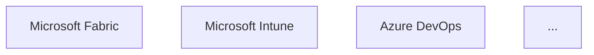

# Task 1.1: Repository Exploration with GitHub Copilot

**Duration:** 15 minutes
**Difficulty:** Beginner
**GitHub Copilot Features:** @workspace agent, Copilot Chat

## Objective

Quickly understand the structure, organization, and purpose of the Microsoft Learn training modules repository using GitHub Copilot's @workspace agent and context awareness.

## Context

You've just inherited an unfamiliar repository containing Microsoft Learn training content for Microsoft Fabric, Intune, and DevOps. Before diving into fixes, you need to understand what you're working with. Manual exploration of 50+ module folders would take hours - GitHub Copilot's @workspace agent can analyze the entire repository and help you understand the landscape in minutes.

## Your Challenge

Create a comprehensive repository map using GitHub Copilot's workspace understanding to answer key questions about the Microsoft Learn module structure, content organization, and product coverage.

## Setup

1. **Open the learn-pr content in VS Code:**
   ```bash
   cd learn-pr/wwl
   code .
   ```

2. **Open Copilot Chat:**
   - Press `Ctrl+Shift+I` (Windows/Linux) or `Cmd+Shift+I` (Mac)
   - Or click the Copilot icon in the sidebar

3. **Verify @workspace is available:**
   - Type `@workspace` in the chat - you should see it autocomplete
   - This gives Copilot context about your entire repository

## Tasks

### 1. Generate Repository Structure Overview with @workspace

**Use GitHub Copilot Chat with @workspace:**

Open Copilot Chat and use this prompt:

```
@workspace Analyze this Microsoft Learn content repository in `learn-pr/wwl` and provide:
1. A summary of the folder structure and organization pattern
2. The main product areas covered (Microsoft Fabric, Intune, DevOps, etc.)
3. The types of content in each module (tutorials, conceptual, exercises, knowledge checks)
4. Common file patterns (index.yml, includes/, media/)
5. How modules are structured with YAML metadata and markdown content

Format as markdown for easy copying.
```

**Why @workspace?** The @workspace agent gives Copilot context about your entire repository structure, file contents, and relationships - providing much richer analysis than looking at individual files.

**Expected Output:** Copilot will analyze the entire workspace and provide:

- Overview of module folder structure
- Product area categorization
- Content type distribution
- File naming conventions

**Deliverable:**

1. Create a new file: `repository-map.md`
2. Copy Copilot's response as your first section
3. Clean up formatting if needed

---

### 2. Identify Content Categories by Product

**Copilot Chat Prompt:**

```text
@workspace Categorize all module folders in this repository by:
- Product area (Microsoft Fabric, Intune, DevOps, Windows, Azure, etc.)
- Content type based on folder names and index.yml titles
- Target audience/role (data engineer, administrator, developer, analyst)
- Estimated complexity level based on module descriptions

Present as a table with columns: Module Folder, Product, Content Type, Role, Level
```

**What Copilot Does:**

- Reads all index.yml files in the workspace
- Analyzes module titles and descriptions
- Identifies patterns in metadata
- Generates a comprehensive categorization table

**Pro Tip:** If the table is too long, ask Copilot to summarize:

```text
@workspace Summarize the categorization - how many modules per product area, what's the overall distribution?
```

**Deliverable:** Add the "Content Categories by Product" section to your `repository-map.md`

---

### 3. Analyze Module Structure Patterns

**Copilot Chat Prompt:**

```text
@workspace Analyze the structure of Microsoft Learn modules in this repository. For a few representative modules like get-started-lakehouses and administer-fabric:
1. What is the standard module structure (index.yml, unit files, includes)?
2. How are units organized (introduction, content, exercises, knowledge check, summary)?
3. What metadata fields are used in index.yml files?
4. How do YAML unit files reference markdown content?
5. What are the common patterns for media organization?

Provide a template showing the standard module structure.
```

**What Copilot Does:**

- Analyzes YAML and markdown file patterns
- Identifies common module structure
- Documents metadata fields
- Shows how files reference each other

**Follow-up Prompt (if needed):**

```text
@workspace Show me the metadata fields in an index.yml file and explain what each one means.
```

**Deliverable:** Add "Module Structure Patterns" section to `repository-map.md`

---

### 4. Identify Content Coverage Gaps

**Copilot Chat Prompt:**

```text
@workspace Based on the Microsoft Learn modules present, analyze the content coverage:

Consider:
- Are all major Microsoft Fabric workloads covered (Data Engineering, Data Warehouse, Data Science, Real-Time Intelligence)?
- Is there consistent coverage across Intune topics?
- Are there DevOps areas that seem incomplete?
- Do modules reference other modules that might be missing?
- Are there product areas mentioned in content but lacking dedicated modules?

What topics are well-covered and what might be gaps?
```

**What Copilot Does:**

- Compares existing modules against product portfolios
- Identifies potential content gaps
- Finds cross-references to missing content
- Prioritizes by importance

**Deliverable:** Add "Content Coverage Analysis" section to `repository-map.md`

---

### 5. Create Visual Content Map

**Copilot Chat Prompt:**

```text
@workspace Create a visual map of this Microsoft Learn content repository using Mermaid diagram syntax showing:
1. The main product areas as top-level nodes
2. Module categories under each product
3. Relationships between modules (prerequisites, related content)
4. The typical learner journey through the content

Use this structure:
```



**What Copilot Does:**

- Generates Mermaid diagram syntax
- Shows content architecture
- Maps learning paths
- Identifies relationships between modules

**To Render the Diagram:**

1. Copy the Mermaid code
2. Paste into your `repository-map.md`
3. VS Code with Markdown preview will render it automatically
4. Or use [Mermaid Live Editor](https://mermaid.live) to see it

**Deliverable:** Add "Visual Content Map" section with Mermaid diagram

---

### 6. Generate Key Findings Summary

**Copilot Chat Prompt:**

```text
@workspace Based on our analysis of this Microsoft Learn content repository, provide:
1. Top 3 strengths (what's well organized and comprehensive)
2. Top 3 issues or gaps (what needs work or is missing)
3. Recommended next steps (prioritized)
4. Overall assessment of repository health (1-2 sentences)

Be specific with module names and examples.
```

**What Copilot Does:**

- Synthesizes all previous analysis
- Identifies patterns and priorities
- Provides actionable recommendations
- Gives you talking points for stakeholders

**Deliverable:** Add "Key Findings & Recommendations" section to `repository-map.md`

---

## GitHub Copilot Tips for This Task

### Using @workspace Effectively

✅ **Do:**
- Start prompts with `@workspace` for repository-wide analysis
- Ask follow-up questions to drill deeper
- Request specific formats (tables, lists, diagrams)
- Ask for examples and file references

❌ **Don't:**
- Try to manually read every file (let Copilot do it)
- Forget to use `@workspace` (limits context)
- Accept first response without asking for clarification
- Skip validation (spot-check Copilot's findings)

### Keyboard Shortcuts

- `Ctrl+Shift+I` / `Cmd+Shift+I` - Open Copilot Chat
- `Ctrl+I` / `Cmd+I` - Inline Copilot (for quick edits)
- `Alt+\` - Trigger inline suggestion
- `Tab` - Accept suggestion

### If Copilot's Response is Too Long

Ask it to summarize:
```
Can you provide a shorter version focusing on the most important points?
```

Or ask for specific sections:
```
Let's focus on just the markdown files for now. Analyze those first.
```

---

## Output Format

Your `repository-map.md` should include these sections created with Copilot:

```markdown
# Microsoft Learn Content Repository Map

**Generated with:** GitHub Copilot @workspace
**Date:** [Date]

## Executive Summary
[2-3 sentences from Copilot describing what this repository contains]

## Repository Structure
[Copilot-generated overview of folder structure and organization]

## Content Categories by Product

| Module Folder | Product | Content Type | Role | Level |
|---------------|---------|--------------|------|-------|
| get-started-lakehouses | Microsoft Fabric | Tutorial | Data Engineer | Intermediate |
| administer-fabric | Microsoft Fabric | Conceptual | Administrator | Intermediate |
| ... | ... | ... | ... | ... |

### Summary Statistics
- Total modules: X
- By product: Y Fabric, Z Intune, etc.
- By level: A beginner, B intermediate, C advanced

## Module Structure Patterns

### Standard Module Structure
module-name/
├── index.yml          # Module metadata and unit list
├── 1-introduction.yml # Unit definitions
├── 2-content.yml
├── ...
├── includes/          # Markdown content files
│   ├── 1-introduction.md
│   ├── 2-content.md
│   └── ...
└── media/            # Images and diagrams
    ├── diagram.png
    └── ...

### Key Metadata Fields
- uid: Unique identifier for the module
- ms.date: Last update date
- author: Content author
- ms.service: Product/service area
...

## Content Coverage Analysis
[Copilot's analysis of what's covered and what might be missing]

### Well-Covered Areas
1. [Area 1]
2. [Area 2]

### Potential Gaps
1. [Gap 1]
2. [Gap 2]

## Visual Content Map
[Copilot-generated Mermaid diagram]

## Key Findings

### Strengths
1. [Strength 1]
2. [Strength 2]
3. [Strength 3]

### Issues/Gaps
1. [Issue 1]
2. [Issue 2]
3. [Issue 3]

### Recommended Next Steps
1. [Action 1]
2. [Action 2]
3. [Action 3]

## Overall Assessment
[Copilot's 1-2 sentence summary of repository health]
```

---

## Success Criteria

You've completed this task when you can:

- ✅ Explain the Microsoft Learn module structure to someone who's never seen it
- ✅ List all major product areas with module counts
- ✅ Describe how YAML and markdown files work together in a module
- ✅ Identify 5+ potential content gaps or areas for improvement
- ✅ Provide a visual map showing content architecture
- ✅ Make informed recommendations about priorities

---

## Advanced: Going Deeper with Copilot

Once you have the basics, try these advanced prompts:

**Analyze Content Freshness:**

```text
@workspace Which modules have the oldest ms.date values in their index.yml files? Look for dates older than 2024.
```

**Find Related Modules:**

```text
@workspace If I wanted to update the lakehouse documentation, which other modules would likely need updates too due to cross-references?
```

**Suggest Learning Paths:**

```text
@workspace Based on the existing modules, suggest a logical learning path for someone new to Microsoft Fabric.
```

---

## Hints

<details>
<summary>Hint 1: @workspace is Your Friend</summary>

Always use `@workspace` at the start of your prompts for repository-wide analysis. Without it, Copilot only knows about the currently open file.

Compare:
- ❌ "Analyze this repository" (limited context)
- ✅ "@workspace Analyze this repository" (full context)
</details>

<details>
<summary>Hint 2: Focus on index.yml Files</summary>

The index.yml files contain the key metadata for each module. Ask Copilot to analyze these specifically:

- "@workspace List all index.yml files and their titles"
- "@workspace What authors are most common across index.yml files?"

</details>

<details>
<summary>Hint 3: Request Specific Formats</summary>

Tell Copilot how you want the output:

- "as a markdown table"
- "as a bullet list"
- "as a Mermaid diagram"
- "grouped by product area"

This makes responses more useful.

</details>

<details>
<summary>Hint 4: Validate Findings</summary>

Copilot is powerful but not perfect. Spot-check:

- Do the modules it mentions actually exist?
- Are the product categorizations accurate?
- Does the metadata analysis make sense?

Trust but verify.

</details>

---

## Time Management

- **Minutes 0-3:** Set up workspace, open Copilot Chat
- **Minutes 4-7:** Repository structure and product categories
- **Minutes 8-10:** Module structure patterns analysis
- **Minutes 11-13:** Content coverage and visual map
- **Minutes 14-15:** Key findings and create final document

---

## What's Next?

After completing your repository map, you'll move to **Task 1.2** where you'll use GitHub Copilot to conduct a detailed content quality audit, finding specific issues like broken links and outdated information.

---

## Troubleshooting

**Problem:** @workspace not available

**Solution:** Make sure you have:

- GitHub Copilot extension installed and activated
- Opened the folder in VS Code (not just individual files)
- Latest version of VS Code

**Problem:** Copilot's responses are too generic

**Solution:** Be more specific in your prompts:

- Reference specific module folders
- Ask for specific file types (index.yml, .md files)
- Request examples with file paths

**Problem:** Copilot missed something

**Solution:** Ask directly:

- "@workspace Show me the structure of the get-started-lakehouses module"
- "@workspace What's in the includes folder for administer-fabric?"

---

**Ready for the next step?** Continue to [Task 1.2: Content Audit](task-1.2-audit.md) to identify issues in the documentation.
